# QUAD-TREE MAPPER

## Contents:
1. [Project Overview](#project-overview)
2. [Installation](#installation)
3. [Use](#use)
4. [Sample Dataset](#sample-dataset)
5. [Under The Hood](#under-the-hood)
6. [Future Updates](#future-updates)

## Project Overview:
This project uses a point-region (PR) [quad-tree](https://en.wikipedia.org/wiki/Quadtree#:~:text=A%20quadtree%20is%20a%20tree,into%20four%20quadrants%20or%20regions.) to record 2-dimensional (x,y) coordinates and store them on a map. After recording the data users can then search for a SINGLE point (i.e. mode 1), or search for a COLLECTION of points via a RANGE query (i.e mode 2). Note, each coordinate may contain 'additional information' (e.g. longitude, latitude, etc...) which can further be collected & queried/filtered.

A `point` query will search the quad-tree if it exists on the map. If the point exists the program will output to two locations being:
<ul>
    <li>output.out: A file containing the matched coordinates & it's meta-data</li>
    <li>output.stdout.out: A set of ordered quadrants (from the root) that need to be visited in order to reach the queried coordinates</li>
</ul>
<table>
    <tr>
        <th>Dataset File:</th>
        <td>tests/dataset_20.csv</td>
        <td>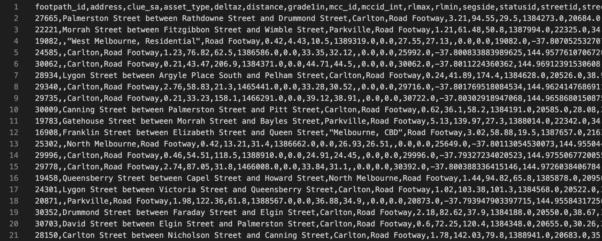</td>
    </tr>
    <tr>
        <th>Input File:</th>
        <td>tests/test6.s3.in</td>
        <td>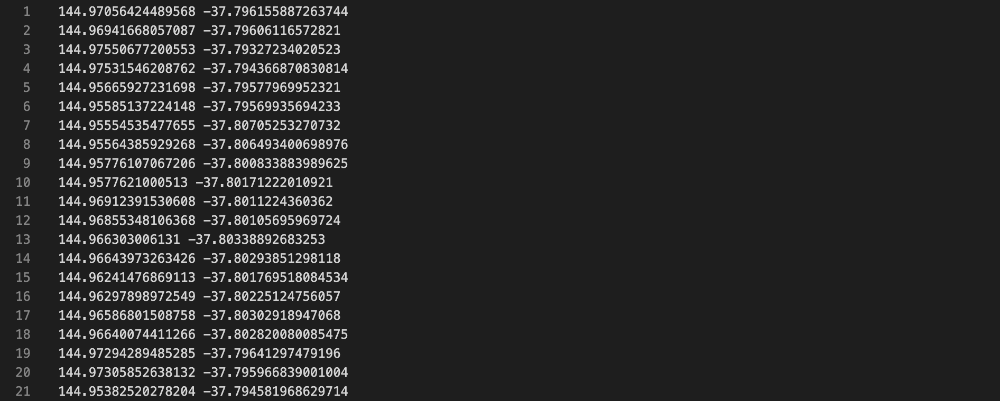</td>
    </tr>
    <tr>
        <th>Output File:</th>
        <td>tests/test6.s3.out</td>
        <td>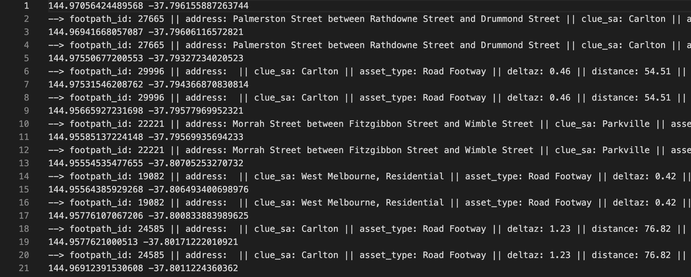</td>
    </tr>
    <tr>
        <th>Standard Output:</th>
        <td>tests/test6.s3.stdout.out</td>
        <td>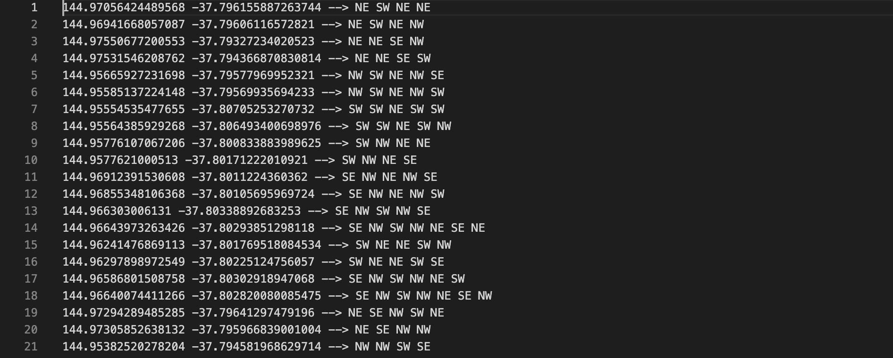</td>
    </tr>
</table>

A `range` query will search within a rectangle of the quad-tree. Similar to the point query, the program will out to two locations being:
<ul>
    <li>output.out: A file containing ALL the matched coordinates & it's meta-data</li>
    <li>output.stdout.out: A set of ordered quadrants (from the root) that need to be visited in order to reach the queried coordinates</li>
</ul>
<table>
    <tr>
        <th>Dataset File:</th>
        <td>tests/dataset_100.csv</td>
        <td>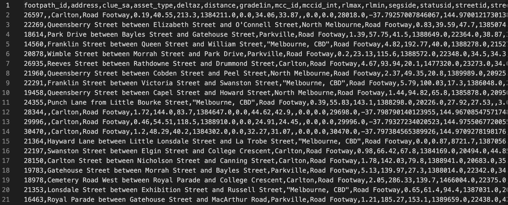</td>
    </tr>
    <tr>
        <th>Input File:</th>
        <td>tests/test13.s4.in</td>
        <td>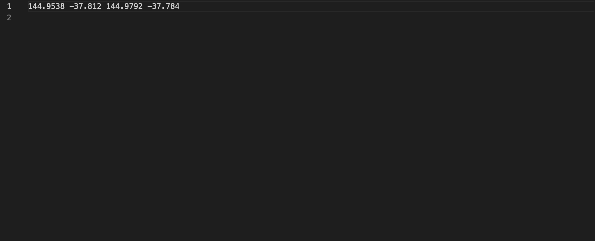</td>
    </tr>
    <tr>
        <th>Output File:</th>
        <td>tests/test13.s4.out</td>
        <td>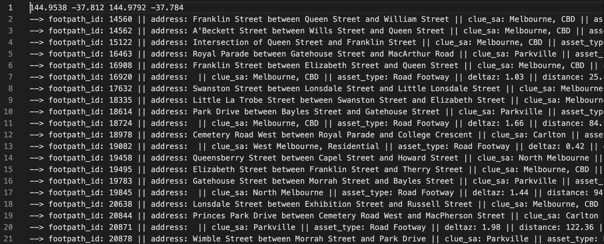</td>
    </tr>
    <tr>
        <th>Standard Output:</th>
        <td>tests/test13.s4.stdout.out</td>
        <td>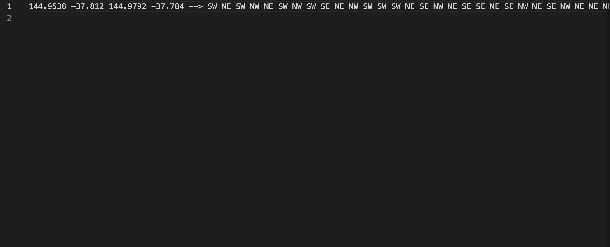</td>
    </tr>
</table>

## Installation:
<table>
    <thead>
        <tr>
            <th>OPTION 1 - Via Git Clone</th>
            <th>OPTION 2 - Via ZIP</th>
        </tr>
    </thead>
    <tbody>
        <tr>
            <td colspan=2>1. Click the `Code` button</td>
        </tr>
        <tr>
            <td>2. Using either the `HTTPS` or `SSH` copy the link</td>
            <td>2. Click on `Download ZIP`</td>
        </tr>
        <tr>
            <td>3. Using your device's terminal emulator run `git clone &ltlink here&gt` in a desired directory</td>
            <td>3. Unzip the download & move the folder in a desired directory</td>
        </tr>
    </tbody>
</table>

## Use:

## Sample Dataset:
The dataset used to test this project comes from the [The City Of Melbourne Open Data](https://data.melbourne.vic.gov.au/) website. In particular, the [Footpath Steepness](https://data.melbourne.vic.gov.au/explore/dataset/footpath-steepness/information/?location=12,-37.81309,144.94569&basemap=mbs-7a7333) dataset was combined with the [Small Areas for Census of Land Use and Employment (CLUE)](https://www.melbourne.vic.gov.au/about-melbourne/research-and-statistics/city-economy/census-land-use-employment/Pages/clue-data-reports.aspx) dataset to create the 'additional attributes':

<table>
    <thead>
        <tr>
            <th>ATTRIBUTE:</th>
            <th>DATA TYPE:</th>
            <th>DESCRIPTION:</th>
        <tr>
    </thead>
    <tbody>
        <tr>
            <td>footpath_id</td>
            <td>string</td>
            <td>The row number for this footpath in the original full dataset</td>
        </tr>
        <tr>
            <td>address </td>
            <td>string</td>
            <td>A name describing the location of the footpath</td>
        </tr>
        <tr>
            <td>clue_sa</td>
            <td>string</td>
            <td>The CLUE small area the footpath is in</td>
        </tr>
        <tr>
            <td>asset_type</td>
            <td>string</td>
            <td>The name of the type of footpath</td>
        </tr>
        <tr>
            <td>deltaz</td>
            <td>double</td>
            <td>The change in vertical distance along the footpath</td>
        </tr>
        <tr>
            <td>distance</td>
            <td>double</td>
            <td>The length of the footpath (full geometry) in metres</td>
        </tr>
        <tr>
            <td>grade1in</td>
            <td>double</td>
            <td>The percentage gradient of the footpath (full geometry)</td>
        </tr>
        <tr>
            <td>mcc_id</td>
            <td>integer</td>
            <td>The id number identifying the footpath</td>
        </tr>
        <tr>
            <td>mccid_int</td>
            <td>integer</td>
            <td>A second number identifying the road or intersection the footpath borders</td>
        </tr>
        <tr>
            <td>rlmax</td>
            <td>double</td>
            <td>The highest elevation on the footpath</td>
        </tr>
        <tr>
            <td>rlmin</td>
            <td>double</td>
            <td>The lowest elevation on the footpath</td>
        </tr>
        <tr>
            <td>segside</td>
            <td>string</td>
            <td>The side of the road which the footpath is on</td>
        </tr>
        <tr>
            <td>statusid</td>
            <td>integer</td>
            <td>The status of the footpath</td>
        </tr>
        <tr>
            <td>streetid</td>
            <td>integer</td>
            <td>The ID of the first street in the Address</td>
        </tr>
        <tr>
            <td>street_group</td>
            <td>integer</td>
            <td>The footpath_id of one of the footpaths connected to this footpath without a gap</td>
        </tr>
        <tr>
            <td>start_lat</td>
            <td>double</td>
            <td>The latitude (y) of the starting point representing the line approximation of the footpath</td>
        </tr>
        <tr>
            <td>start_lon</td>
            <td>double</td>
            <td>The longitude (x) of the starting point representing the line approximation of the footpath</td>
        </tr>
        <tr>
            <td>end_lat</td>
            <td>double</td>
            <td>The latitude (y) of the ending point representing the line approximation of the footpath</td>
        </tr>
        <tr>
            <td>end_lon </td>
            <td>double</td>
            <td>The longitude (x) of the starting point representing the line approximation of the footpath</td>
        </tr>
    </tbody>
</table>

## Under The Hood:

While [binary search trees](https://en.wikipedia.org/wiki/Binary_search_tree) have a maximum of 2 child nodes per parent node, quad-trees have a maximum of 4 child nodes per parent node. The 'root' node of the quad-tree represents the boundary future points must lie within. Each child node represents a quandrant within the parent boundary with quadrants 1, 2, 3 & 4 representing North-West (NW), North-East (NE), South-West (SW) & South-East (SE) areas.

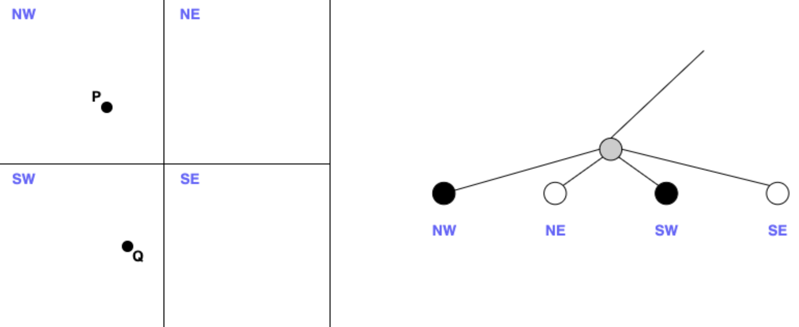

This implementation of a quad-tree enforces a 1 quadrant per 1 coordinate rule when inserting new coordinates (i.e. nodes). If this rule is violated the quadrant will subdivide itself into smaller quadrants until the aforementioned rule is satisfied. While this can be costly memory-wise, this setup allows for a quick lookup time of O(log4(n)) for individual queries, & roughly O(n + h) for range queries.

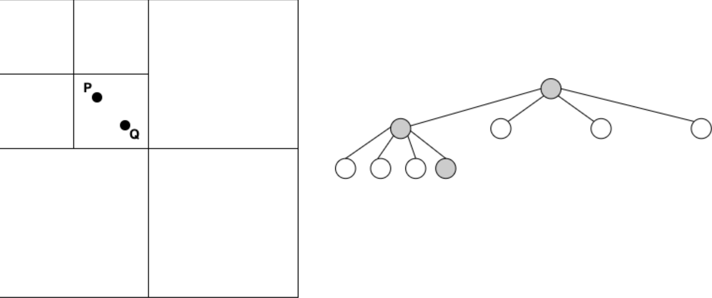
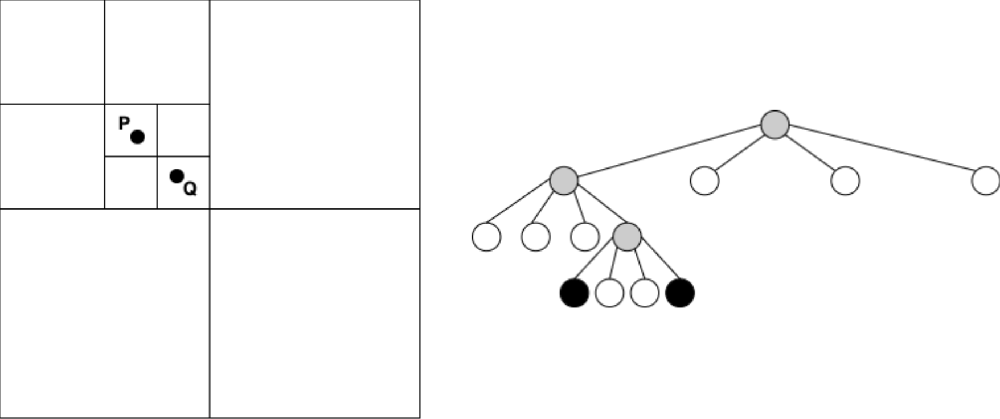

## Future Updates:
- A user-interface to display the map & data points